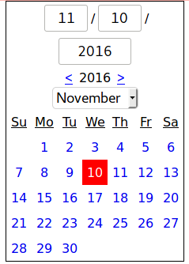

# purescript-halogen-calendar-datepicker

This is a halogen widget that looks like a calendar and allows you to pick a date. Styled as in [the example](dist/index.html), it  looks like this:

# This project was bootstrapped with
https://github.com/slamdata/purescript-halogen-template
